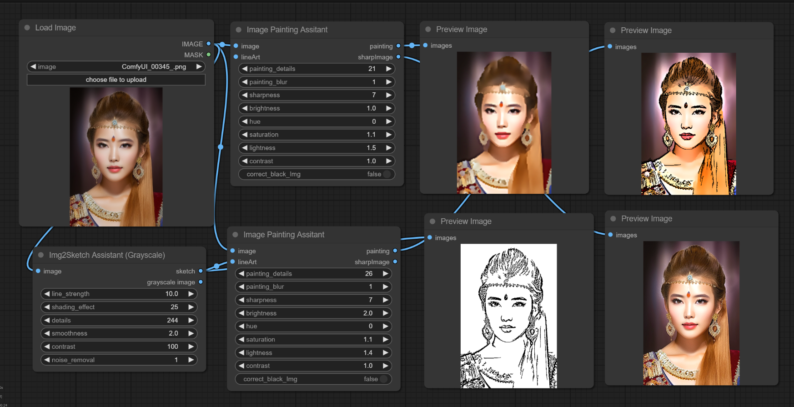
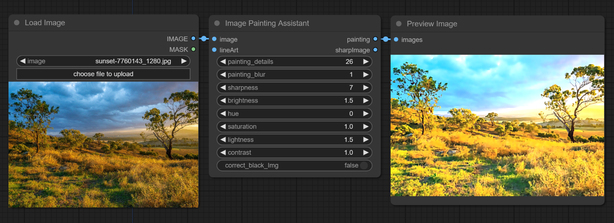
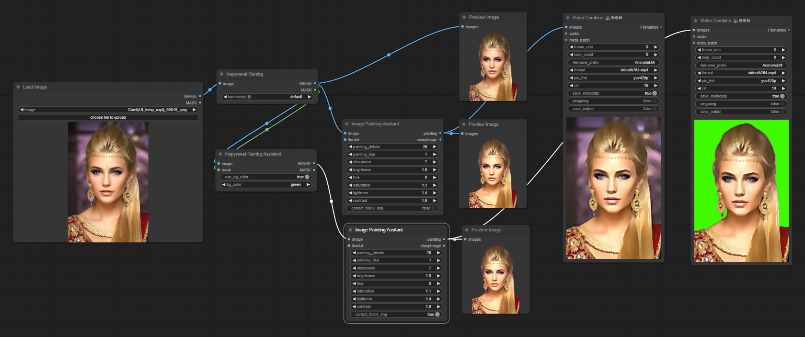

# ComfyUI-Img2PaintingAssitant
These are ComfyUI nodes to assist in converting an image to paintings and to assist the Inspyrenet Rembg node to totally remove or replace with a color the original background from images so that the background does not reappear in videos or in nodes that do not provide handling for the alpha channel in images.

## Image Painting Assistant

The `Image Painting Assistant` node can assist you in converting images to paintings and cartoon images. It can also be used to sharpen and lighten the input image.

   

## Inspyrenet Rembg Assistant

The `Inspyrenet Rembg Assistant` node can be used to ensure that the original background of an image doesn't reappear when the image is inputed into comfyUI nodes that do not retain the alpha channel in images like the Video Combine custom node. It can also be used to create a greenscreen or use other colors for the background.

   

